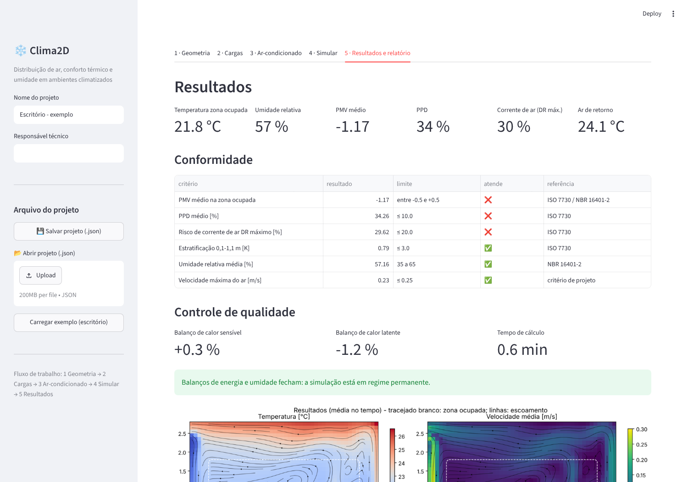
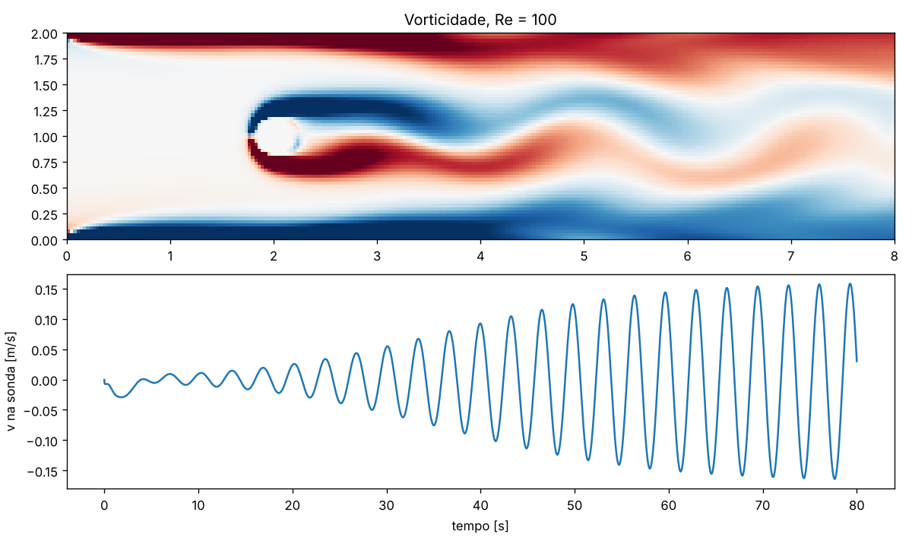
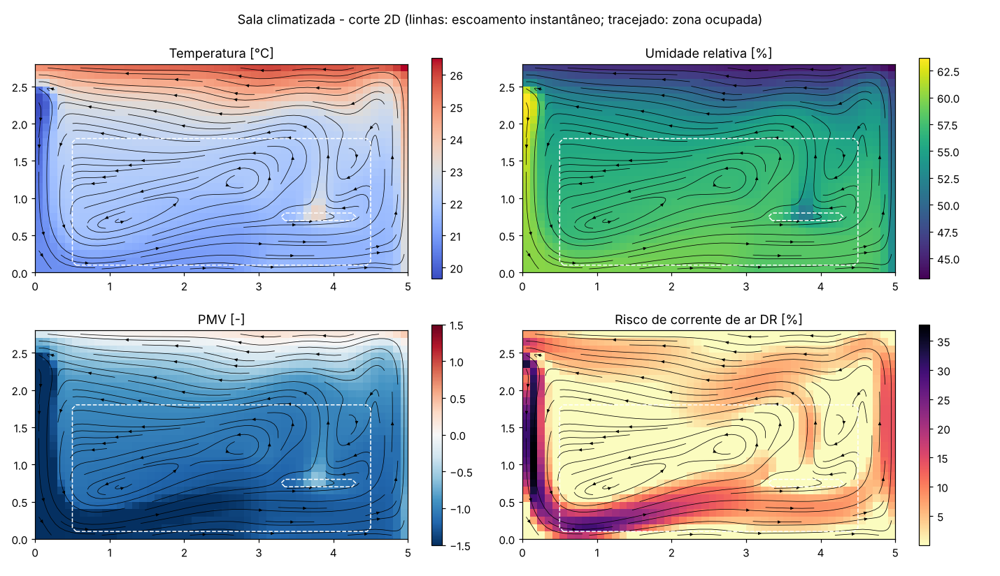

# AeroJAX para climatização: guia de capacitação

Material de estudo e ferramentas para usar o [AeroJAX](https://github.com/arriemeijer-creator/AeroJAX)
e o JAX em problemas de **ar-condicionado e controle de umidade**.

## Leia isto primeiro: o que o AeroJAX faz e o que não faz

O AeroJAX é um simulador CFD 2D interativo, feito para **aerodinâmica externa**:
perfis NACA, cilindros, esteiras. Analisei o código e encontrei quatro limitações.
Juntas, elas impedem o uso direto do solver dele em climatização:

| Necessidade em climatização | AeroJAX original |
|---|---|
| Sala fechada, insuflamento e retorno em qualquer parede | Contorno fixo: entrada à esquerda e saída à direita (`solver/pure_functions/step.py`). Os operadores são periódicos na vertical (`solver/operators.py`). |
| Empuxo térmico (ar frio desce, ar quente sobe) | Não tem no solver principal. Só existe uma janela térmica separada e simplificada (`viewer/thermal_simulation.py`). |
| Transporte de umidade | Não tem. Só um "corante" passivo limitado a 0–1. |
| Cargas (pessoas, equipamentos, fachada) e conforto (PMV, corrente de ar) | Não tem. |

O que vale a pena aprender no AeroJAX é **a forma de trabalhar**:
- o solver é escrito como função pura de JAX;
- o estado é um PyTree, avançado no tempo com `jax.lax.scan`;
- a simulação inteira é diferenciável com `jax.grad`, então dá para otimizar o projeto pelo gradiente.

Esta pasta aplica essa mesma arquitetura a ambientes climatizados, no pacote `hvac/`.

> **Uso profissional:** um modelo 2D serve para estudo, comparação de alternativas e
> pré-projeto. Não substitui o cálculo pela ABNT NBR 16401 nem uma CFD 3D validada
> (OpenFOAM, Ansys Fluent, ou FDS, que também tem módulo de HVAC) quando o resultado
> entra em projeto executivo ou laudo.

## Interface gráfica (Clima2D)

Para usar sem programar: dê **dois cliques em `iniciar.bat`** (Windows). A interface abre
no navegador e permite:
- importar planta ou corte em DXF;
- editar cargas e equipamento;
- simular;
- baixar um relatório técnico com verificação ISO 7730 / NBR 16401-2.

**Manual simplificado, com telas: [manual/MANUAL.md](manual/MANUAL.md).**



## Conteúdo

```
aerojax-hvac/
├── hvac/
│   ├── psicrometria.py   # propriedades do ar úmido (ASHRAE), mistura, serpentina, ADP/BF
│   ├── conforto.py       # PMV/PPD (ISO 7730 / NBR 16401-2) e risco de corrente de ar (DR)
│   ├── sala2d.py         # CFD 2D de sala: velocidade + temperatura + umidade, diferenciável
│   ├── projeto.py        # projeto (JSON), cargas, simulação, conformidade, relatório
│   └── importar_dxf.py   # importação de planta/corte DXF por layers
├── exemplos/
│   ├── 01_aerojax_cilindro.py         # usar o AeroJAX original sem a interface gráfica
│   ├── 02_psicrometria_serpentina.py  # cargas, ar externo, serpentina, controle de umidade
│   ├── 03_sala_ar_condicionado.py     # simulação da sala com split/fan-coil de parede
│   └── 04_otimizacao_insuflamento.py  # otimização de vazão, ângulo e temperatura com jax.grad
├── app/app.py            # interface gráfica (Streamlit)
├── manual/MANUAL.md      # manual simplificado da interface
├── iniciar.bat / .sh     # abre a interface (instala tudo na primeira vez)
├── testes/test_hvac.py   # verificação contra ASHRAE, ISO 7730 e balanço de energia
└── resultados/           # figuras geradas pelos exemplos
```

## Instalação

Windows (PowerShell):

```powershell
python -m venv .venv
.venv\Scripts\activate
pip install -r requirements.txt
python -m pytest testes -q          # deve terminar com "23 passed"
```

Linux/macOS: igual, mas ative o ambiente com `source .venv/bin/activate`.

Para o exemplo 01 (AeroJAX original), clone o AeroJAX, instale as dependências dele
e indique onde ele está:

```powershell
git clone https://github.com/arriemeijer-creator/AeroJAX ..\AeroJAX
pip install -r ..\AeroJAX\requirements.txt
$env:AEROJAX_DIR = "..\AeroJAX"
python exemplos\01_aerojax_cilindro.py
```

Para abrir a interface gráfica do AeroJAX: `python main.py` dentro da pasta dele.

---

## Trilha de estudo

Cada módulo tem objetivo, leitura e exercício. A estimativa considera 1–2 h por dia.

### Módulo 0 — JAX em 1 semana

O JAX é NumPy com três superpoderes. Entenda cada um antes de abrir o AeroJAX:

| Recurso | O que faz | Onde aparece aqui |
|---|---|---|
| `jax.jit` | compila a função para rodar rápido | `jax.jit(lambda e: simular(...))` |
| `jax.grad` | derivada exata de qualquer função escrita em JAX | sensibilidades no exemplo 02, otimização no 04 |
| `jax.lax.scan` | laço no tempo que o JAX consegue compilar e derivar | `simular()` em `hvac/sala2d.py` |

Regras que mais causam erro:
- arrays são imutáveis: use `x = x.at[i].set(v)` em vez de `x[i] = v`;
- dentro de função com `jit` não use `if` sobre valores de arrays, use `jnp.where`.

- Leitura: tutorial oficial "JAX 101" (jax.readthedocs.io).
- Exercício: em `hvac/psicrometria.py`, calcule `jax.grad(psi.umidade_relativa)(24.0, 0.010)`.
  Interprete: quanto a UR cai por °C de aquecimento sensível?

### Módulo 1 — Conhecendo o AeroJAX (1 semana)

1. Rode a interface gráfica (`python main.py`). Mude Re, ângulo do NACA e solver de pressão
   com a simulação rodando.
2. Entenda o mapa do código:
   - `solver/params.py`: `SimState` (o estado como PyTree), `GridParams`, `FlowParams`;
   - `solver/pure_functions/step.py`: **o passo de tempo**. Siga a ordem: advecção-difusão
     → divergência → Poisson da pressão → correção da velocidade → contornos;
   - `pressure_solvers/`: multigrid, gradiente conjugado, FFT;
   - `solver/brinkman.py`: obstáculos por penalização;
   - `solver/solver.py`: `differentiable_rollout` e `design_loss`, o "pulo do gato" para otimizar;
   - `validation/`: comparação com Ghia (cavidade) e com esteira de von Kármán.
3. Rode o `exemplos/01_aerojax_cilindro.py`.

**Exercício de validação:** com Re = 100, este exemplo deu **St ≈ 0,12**, medido depois de
40 s, com o desprendimento de vórtices já saturado. A literatura dá 0,16–0,17
(Williamson, 1996).



Pistas para investigar a diferença:
- a figura mostra camadas de vorticidade fortes nas paredes superior e inferior do canal,
  o que indica um contorno diferente do escorregamento livre esperado;
- o diâmetro efetivo do cilindro "borrado" pela máscara de Brinkman (`eps_multiplier`);
- a resolução da malha (0,4 m / 3,1 cm ≈ 13 células no diâmetro);
- o bloqueio de 20 % do canal.

Esse é o hábito mais importante em CFD: **nunca confie num número que você não validou.**

### Módulo 2 — CFD aplicada a ambientes (2 semanas)

Leia `hvac/sala2d.py` de cima para baixo. Ele tem cerca de 500 linhas e cada bloco é comentado.

| Conceito | Onde está | Para entender |
|---|---|---|
| Malha deslocada (MAC) | `Estado`, `_projetar` | por que u, v e p ficam em lugares diferentes |
| Método da projeção | `_projetar` | Poisson resolvido por DCT, divergência zero |
| Advecção TVD | `_fluxo_tvd` | limitador van Leer: sem oscilações e pouca difusão numérica |
| Empuxo (Boussinesq) | `_rhs_momento` | temperatura virtual: o vapor também deixa o ar mais leve |
| Contornos | `_velocidades_aberturas` | insuflamento, retorno e balanço de massa |
| Estabilidade | `dt_estavel` | critérios de CFL e de difusão |
| Turbulência | `Sala.nu_efetiva` | viscosidade turbulenta constante: **parâmetro de calibração** |

- Leitura recomendada: Ferziger & Perić, *Computational Methods for Fluid Dynamics*,
  cap. 7 (projeção) e cap. 4 (advecção); Nielsen, *Ventilation of Rooms*, para jatos de
  insuflamento.
- Exercício: rode o exemplo 03 com `--fino` (malha de 5 cm) e compare os indicadores.
  Se mudarem muito, a malha grossa não basta (estudo de independência de malha).
- Exercício: varie `nu_efetiva` entre 5e-4 e 5e-3 e veja quanto o PMV muda. Isso mostra
  o tamanho da incerteza do modelo de turbulência.

### Módulo 3 — Psicrometria e controle de umidade (1 semana)

Rode `exemplos/02_psicrometria_serpentina.py`. Ele mostra:
- os estados interno, externo e de mistura;
- o estado de insuflamento necessário para as cargas;
- o ADP e o fator de bypass da serpentina;
- a capacidade em W, TR e BTU/h e a água condensada;
- a alternativa de resfriar e reaquecer.

O ponto central do controle de umidade é o FCS (fator de calor sensível) da serpentina:

| Setpoint | ADP | Capacidade | Condensado |
|---|---|---|---|
| 24 °C / 50 % UR | 10,2 °C | 1386 W | 0,52 kg/h |
| 24 °C / 60 % UR | 14,6 °C | 1327 W | 0,43 kg/h |

Abaixar a UR de projeto exige serpentina mais fria (pior COP) ou reaquecimento.

As **sensibilidades** são calculadas por `jax.grad`:
- +1 m³/h de ar externo custa +9,9 W de capacidade;
- +1 % de UR no setpoint economiza 5,9 W.

Para trocar os dados ilustrativos pelos reais:
- clima de projeto da cidade: NBR 16401-1, Anexo A;
- cargas: NBR 16401-1;
- vazão de ar externo: NBR 16401-3.

### Módulo 4 — Simulando a sala (1 semana)

`exemplos/03_sala_ar_condicionado.py` simula um escritório com:
- unidade de parede, com insuflamento e retorno;
- 2 pessoas, 1 computador, uma mesa;
- fachada ensolarada e cobertura.



**O que o resultado ensina:**
- **Os balanços fecham.** O ar retira 901 W sensíveis e 110 W latentes; as cargas eram
  898 W e 110 W. O retorno sai a 24,06 °C e 9,30 g/kg, como o exemplo 02 previu. Esse é o
  primeiro teste de qualquer simulação sua.
- **O termostato mente.** O retorno está a 24 °C, mas a zona ocupada está a **21,8 °C**
  (PMV −1,2, frio). O jato frio, de baixa velocidade, "despenca" junto à parede e forma
  um lago de ar frio no piso. Esse problema real só aparece com CFD.

**Como modelar o seu caso:**
1. Edite `Sala(...)`:
   - dimensões;
   - `aberturas` (parede, início, fim, tipo);
   - `fontes` (W sensível e latente);
   - `obstaculos`;
   - `fluxo_*` das paredes em W/m².
2. Edite `Insuflamento(...)`: vazão, ângulo, temperatura e umidade. Use o exemplo 02 para
   calcular temperatura e umidade.
3. Confira o balanço de energia e de umidade, depois a independência de malha. Só então
   analise o conforto.

**Hipótese 2D:** o difusor ocupa toda a profundidade da sala, como um difusor linear. A
vazão é preservada, mas a velocidade do jato fica menor que a de um split real. Para
splits, o alcance do jato é subestimado. Use para comparar alternativas, não para
prever valores absolutos.

### Módulo 5 — Otimização (1 semana)

`exemplos/04_otimizacao_insuflamento.py` ajusta três parâmetros: vazão, ângulo das aletas
e temperatura de insuflamento. Ele minimiza uma função objetivo com quatro termos:

```
J = PMV_médio² + PMV_desvio²                    (conforto)
  + 100·[violação de 40 % ≤ UR ≤ 60 %]²         (umidade)
  + [(DR_máx − 20 %)/10]²                       (corrente de ar)
  + 0,05·(vazão/600)³                           (energia do ventilador)
```

O ar sai da serpentina com ~90 % UR, então insuflar mais quente melhora o PMV mas
desumidifica menos. O otimizador encontra o compromisso.

O gradiente dos 3 parâmetros sai de uma única passagem reversa por ~30 mil passos de
CFD. Esse é o diferencial de ter tudo em JAX: com 30 parâmetros, como a posição de
cada difusor, o custo seria praticamente o mesmo.

_(Resultados da otimização serão adicionados após a execução completa do exemplo.)_

- Exercício: inclua a posição do insuflamento como variável de projeto. Dica: as máscaras
  de `montar_geometria` precisam virar funções suaves do parâmetro.
- Exercício: troque o termo de ventilador pelo consumo do compressor. Use COP em
  função do ADP, a partir do catálogo de um fabricante.

---

## Verificação

`python -m pytest testes -q` roda 23 testes:
- pressão de saturação contra a tabela da ASHRAE (−10 a 40 °C);
- consistência entre UR, ponto de orvalho e bulbo úmido;
- ADP e BF da serpentina (ida e volta);
- PMV contra a tabela D.1 da ISO 7730 (5 casos, erro < 0,015). O PMV também foi conferido
  contra a biblioteca `pythermalcomfort`;
- divergência nula do campo de velocidade;
- **balanço de energia e de umidade em regime permanente** (erro < 2–3 %);
- gradiente do `jax.grad` através da CFD contra diferenças finitas;
- rejeição de aberturas que a malha não consegue resolver;
- importação de corte e planta DXF (inclusive em milímetros), projeto JSON, cargas e validação.

## Próximos passos sugeridos

- Calibrar `nu_efetiva` com uma medição sua: velocidade e temperatura em alguns pontos de
  uma sala real.
- Para casos 3D ou de projeto executivo: OpenFOAM (`buoyantPimpleFoam` com transporte de
  umidade). O raciocínio aprendido aqui (contornos, balanços, malha, validação) é o mesmo.
- Simulação energética anual (consumo, controle de umidade ao longo do ano): EnergyPlus.
