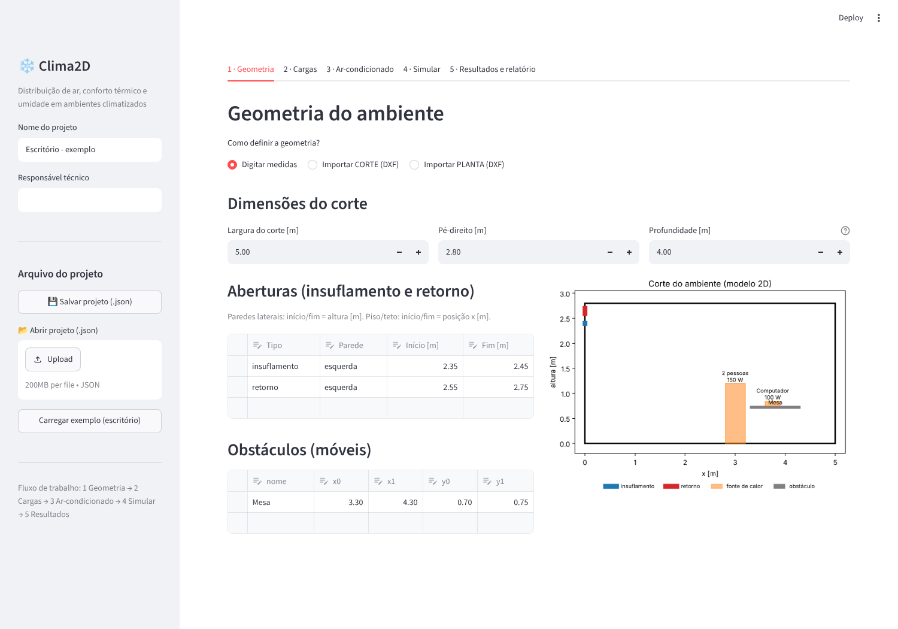
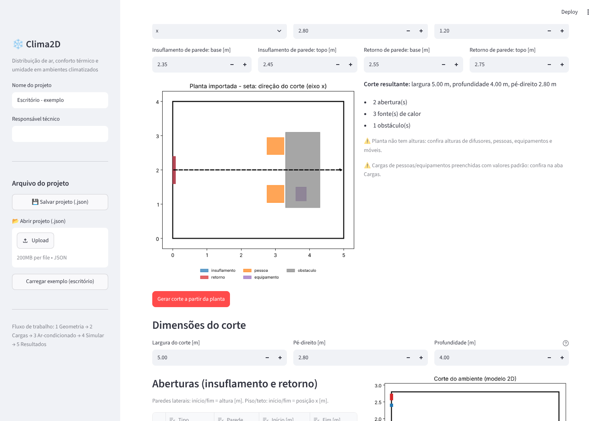
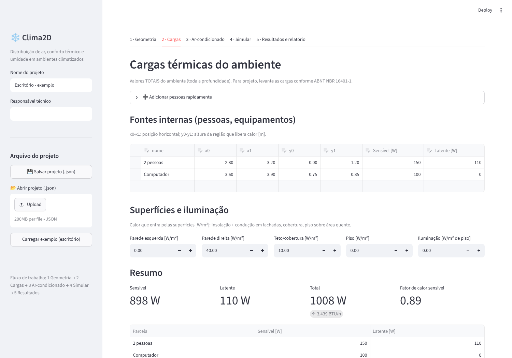
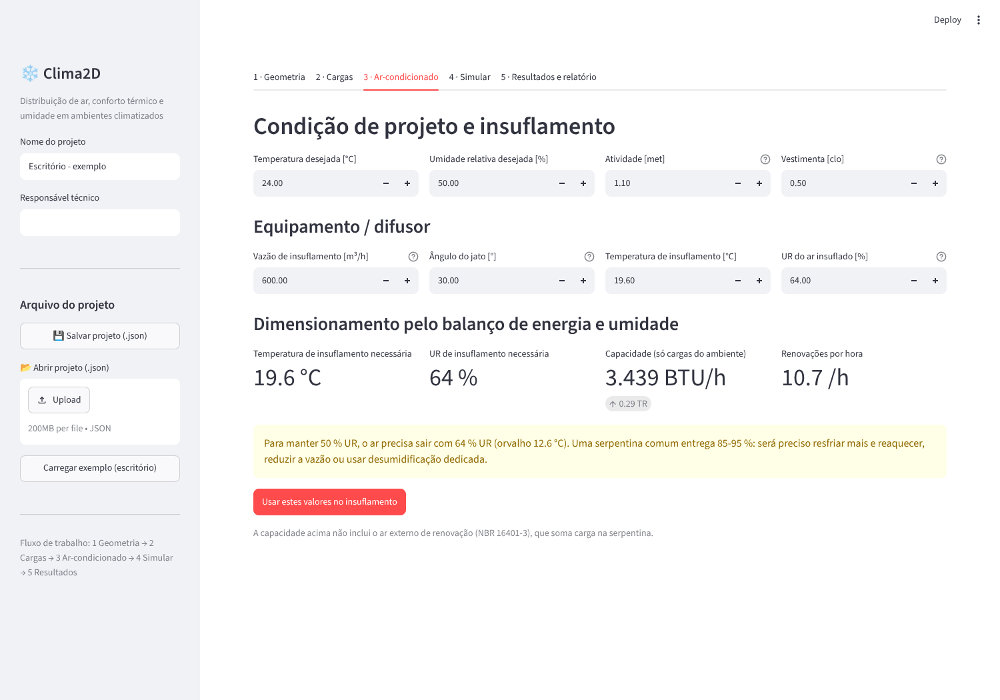
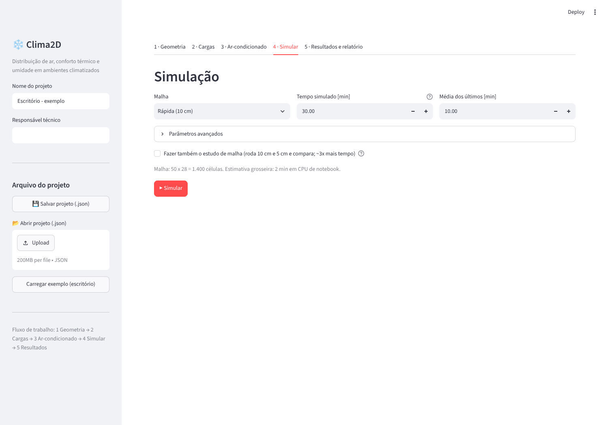
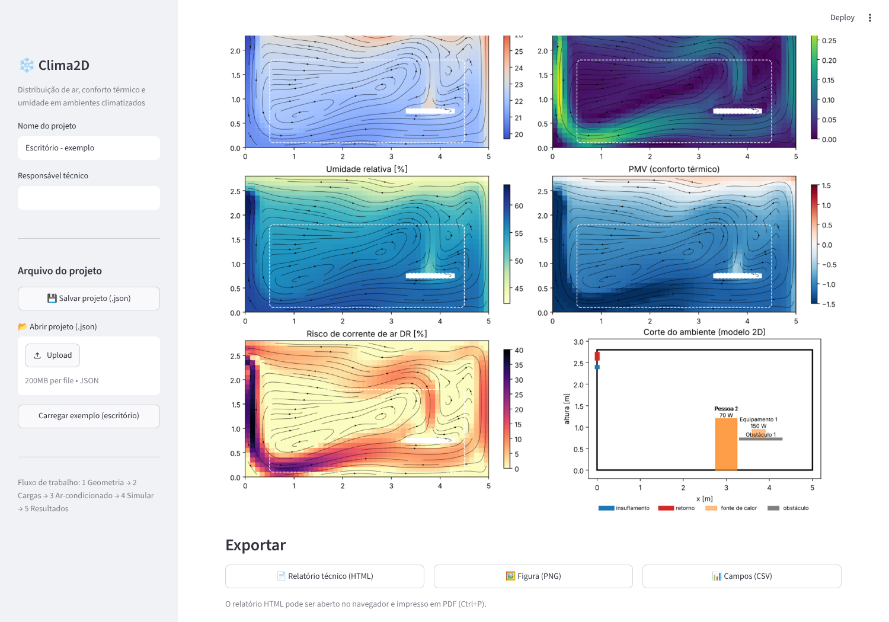

# Clima2D — Manual simplificado

O Clima2D simula como o ar do ar-condicionado se espalha num ambiente. Ele mostra:
- temperatura, umidade e velocidade do ar;
- conforto térmico (PMV/PPD) e risco de corrente de ar;
- um relatório com a verificação contra a ISO 7730 e a NBR 16401-2.

---

## 1. Instalar e abrir (Windows)

1. Instale o **Python 3.11 ou mais novo** em [python.org](https://www.python.org/downloads/).
   Na instalação, marque **"Add Python to PATH"**.
2. Baixe esta pasta (`aerojax-hvac`) para o computador.
3. Dê **dois cliques em `iniciar.bat`**.
   - Na primeira vez, ele instala tudo sozinho (5 a 10 minutos).
   - Depois, abre em segundos.
4. O navegador abre o Clima2D. Se não abrir, acesse `http://localhost:8501`.

Para fechar, feche a janela preta (terminal).

---

## 2. Visão geral

A tela tem uma **barra lateral** e **5 abas**, que você segue em ordem:

| Aba | O que você faz |
|---|---|
| 1 · Geometria | Define o ambiente: digitando medidas ou importando planta/corte em DXF |
| 2 · Cargas | Informa pessoas, equipamentos, iluminação e calor das paredes |
| 3 · Ar-condicionado | Informa vazão, ângulo, temperatura e umidade do ar insuflado |
| 4 · Simular | Escolhe a precisão e roda o cálculo |
| 5 · Resultados | Vê mapas, verificação das normas e baixa o relatório |

Na barra lateral, **Salvar projeto** baixa um arquivo `.json` com tudo o que você digitou.
**Abrir projeto** carrega esse arquivo de volta.

> **Importante:** o Clima2D calcula um **corte vertical** do ambiente, como um corte de
> arquitetura. Escolha o corte que passa pelo equipamento, na direção do jato de ar.

---

## 3. Passo a passo

### Passo 1 — Geometria

**Opção A — Digitar medidas:**
- Largura do corte, pé-direito e profundidade (a medida perpendicular ao corte).
- **Aberturas:** uma linha por grelha/difusor.
  - Em parede lateral, *início/fim* é a altura.
  - Em teto ou piso, *início/fim* é a posição horizontal.
- **Obstáculos:** móveis, em metros (x = horizontal, y = altura).
- O desenho à direita se atualiza na hora. Confira se está igual ao seu ambiente.

**Opção B — Importar PLANTA (DXF)** — veja a seção 4 para preparar o arquivo:
1. Escolha **Importar PLANTA (DXF)** e envie o arquivo.
2. Escolha a **direção do corte** (x ou y). A seta tracejada mostra a direção.
3. Informe o pé-direito, a altura das pessoas e as alturas do difusor e do retorno
   (a planta não tem alturas).
4. Clique em **Gerar corte a partir da planta**.

**Opção C — Importar CORTE (DXF):** use quando já houver um corte desenhado. Tudo, inclusive
as alturas, é lido do desenho.

Depois de importar, **sempre confira e ajuste** as tabelas. Os avisos amarelos indicam o
que foi preenchido com valor padrão.

### Passo 2 — Cargas

- **Adicionar pessoas rapidamente:** escolha quantidade, atividade e posição. A carga por
  pessoa é preenchida automaticamente (valores típicos ASHRAE/NBR 16401-1).
- **Fontes internas:** edite a tabela com equipamentos (W sensível) e pessoas (W sensível +
  latente). Valores são o **total do ambiente**.
- **Superfícies:** calor que entra pelas paredes, teto e piso, em W/m². Exemplos:
  - fachada com sol;
  - cobertura sem forro;
  - piso sobre área quente.
- **Iluminação:** W/m² de piso.
- O **resumo** mostra a carga total em W e BTU/h e o fator de calor sensível.

### Passo 3 — Ar-condicionado

1. Informe a **condição desejada** (ex.: 24 °C e 50 %), a atividade (met) e a roupa (clo).
2. Informe os dados do **equipamento**:
   - vazão do catálogo;
   - ângulo das aletas, positivo = para baixo;
   - temperatura e UR do ar insuflado.
3. O quadro **Dimensionamento** calcula a temperatura e a UR de insuflamento que o balanço
   exige. Clique em **Usar estes valores** para copiá-los.
4. **Aviso amarelo de umidade:** se a UR necessária for menor que ~80 %, uma serpentina
   comum não consegue tirar tanta umidade. Será preciso uma destas soluções:
   - resfriar e reaquecer;
   - reduzir a vazão;
   - usar um desumidificador.

### Passo 4 — Simular

| Malha | Quando usar | Tempo típico* |
|---|---|---|
| Rápida (10 cm) | testar alternativas | menos de 1 min |
| Precisa (5 cm) | resultado para relatório | 3 a 10 min |
| Muito precisa (2,5 cm) | ambientes pequenos ou difusores pequenos | 20 a 60 min |

\*Sala de 5 m × 2,8 m, 30 min simulados, CPU de notebook.

- **Tempo simulado:** precisa ser suficiente para a sala "estabilizar". Use 30 min, ou
  60 min em salas grandes.
- Marque **estudo de malha** para relatórios. Ele compara 10 cm com 5 cm.
- Clique em **▶ Simular** e acompanhe a barra de progresso.

### Passo 5 — Resultados e relatório

- **Indicadores** da zona ocupada: tudo o que fica entre 0,1 e 1,8 m de altura e a 0,5 m
  das paredes.
- **Conformidade:** ✅/❌ para cada critério da ISO 7730 (categoria B) e da NBR 16401-2.
- **Controle de qualidade:** os balanços de calor sensível e latente devem ficar dentro
  de ±5 %. Se não ficarem, aumente o tempo simulado.

**Como ler os mapas:**

| Mapa | O que observar |
|---|---|
| Temperatura | ar frio acumulado no piso? ar quente parado no teto? |
| Velocidade | o jato chega onde deveria? há jato forte sobre as pessoas? |
| Umidade relativa | regiões acima de 65 % (risco de mofo e desconforto) |
| PMV | azul = frio, vermelho = calor, branco = conforto |
| DR | onde as pessoas vão sentir "vento gelado" (acima de 20 %) |

**Exportar:**
- **Relatório técnico (HTML):** abra no navegador e imprima em PDF (Ctrl+P). Inclui dados,
  cargas, conformidade, mapas, controle de qualidade e limitações.
- **Figura (PNG)** e **campos (CSV)** abrem no Excel, com separador ";".

---

## 4. Como preparar a planta no AutoCAD (ou similar)

1. Abra a planta e **crie os layers** (comando `LAYER`). O nome só precisa *conter* a palavra:

   | Layer | Desenhe |
   |---|---|
   | `AMBIENTE` | o contorno interno do ambiente, com polilinha fechada (`PLINE` → `C`) |
   | `INSUFLAMENTO` | o equipamento ou difusor: retângulo junto à parede (split) ou no teto (difusor de teto) |
   | `RETORNO` | a grelha de retorno. No split, pode ser o mesmo retângulo do insuflamento |
   | `PESSOA` | um círculo ou retângulo por pessoa, onde ela fica |
   | `EQUIPAMENTO` | computadores, máquinas, geladeiras |
   | `OBSTACULO` | mesas, armários, balcões |

2. Desenhe só o ambiente que será estudado. Outros objetos ficam em outros layers e são
   ignorados.
3. Salve como DXF: `SALVARCOMO` / `SAVEAS` → tipo **DXF** (qualquer versão). As unidades
   (mm, cm ou m) são reconhecidas automaticamente.
4. Na aba Geometria, escolha a **direção do corte** que passa pelo jato do equipamento.
   - Um equipamento na parede da esquerda/direita da planta pede o eixo **x**.
   - Na parede de cima/baixo, o eixo **y**.

Arquivos de exemplo: `exemplos/dxf/planta_escritorio.dxf` e `exemplos/dxf/corte_escritorio.dxf`.

---

## 5. Precisão e uso comercial — leia antes de entregar a um cliente

### O que o Clima2D faz bem

- **Comparar alternativas:** posição do equipamento, ângulo das aletas, vazão,
  temperatura de insuflamento, layout de móveis.
- **Encontrar problemas típicos:**
  - jato frio "despencando" sobre as pessoas;
  - ar parado;
  - estratificação;
  - termostato no retorno lendo temperatura diferente da zona ocupada;
  - umidade alta.
- **Fazer balanços corretos de energia e umidade**, verificados automaticamente.
- **Gerar documentação** clara para discutir com cliente e arquitetura.

### O que ele NÃO garante

- **É 2D.** O difusor é tratado como linear, ocupando toda a profundidade.
  - Para difusores lineares e fan-coils compridos, a representação é boa.
  - Para splits (saída de ~0,8 m) e difusores de 4 vias, o alcance do jato fica
    subestimado. Os valores absolutos de velocidade e PMV ficam aproximados.
- **A turbulência é um parâmetro de calibração** (viscosidade efetiva). Sem calibração com
  medição, trate os resultados como **comparativos**.
- **A carga térmica é dado de entrada.** O cálculo de cargas de projeto continua sendo
  feito pela NBR 16401-1 (planilha ou software de cargas).

### Como tornar o estudo mais confiável

1. Use a malha **Precisa (5 cm)** e marque **estudo de malha**. Diferenças pequenas entre
   as malhas (ex.: PMV < 0,1, temperatura < 0,3 °C) indicam resultado independente da malha.
2. Confirme os **balanços dentro de ±5 %**.
3. **Calibre com medição**, se possível:
   - meça temperatura e velocidade em 3 a 5 pontos de uma sala real com termo-anemômetro;
   - ajuste a *viscosidade turbulenta efetiva* (aba Simular → avançados) até a simulação
     reproduzir as medições;
   - use o valor calibrado em salas parecidas.
4. Em projeto executivo, laudo ou casos críticos (salas limpas, hospitais, data centers,
   grandes auditórios), use **CFD 3D validada**: OpenFOAM, Ansys, Simscale, ou o FDS, que
   tem módulo HVAC. Use o Clima2D para chegar a esse estudo com as alternativas já filtradas.
5. O relatório gerado já traz a seção **"Hipóteses e limitações"**. Mantenha-a no
   documento entregue.

---

## 6. Problemas comuns

| Mensagem / sintoma | Solução |
|---|---|
| "Insuflamento e retorno caem na mesma face da malha" | as grelhas estão muito próximas para a malha: use malha 5 cm ou afaste as aberturas |
| Balanço acima de ±5 % | aumente o tempo simulado (aba 4) |
| "Nenhuma entidade no layer AMBIENTE" | o contorno do ambiente não está num layer com a palavra AMBIENTE |
| Difusor "ignorado" ao importar planta | ele está numa parede paralela ao corte: troque a direção do corte |
| Aviso de umidade na aba 3 | a serpentina sozinha não atinge a UR desejada: veja o Passo 3 |
| Terminal pergunta "Welcome to Streamlit! ... email address" | é uma pergunta opcional do Streamlit (biblioteca da interface), não propaganda: deixe em branco e aperte Enter. O `iniciar.bat` atual já evita essa pergunta e desliga o envio de estatísticas de uso |
| Simulação muito lenta | use malha Rápida para testar e Precisa só no estudo final |
| Zona ocupada bem mais fria (PMV negativo) com o retorno no setpoint | o ar frio se acumula embaixo e o sensor do equipamento fica no retorno, em cima: aumente o setpoint (aba 3) ou mude o ângulo; a aba 5 sugere o valor |
